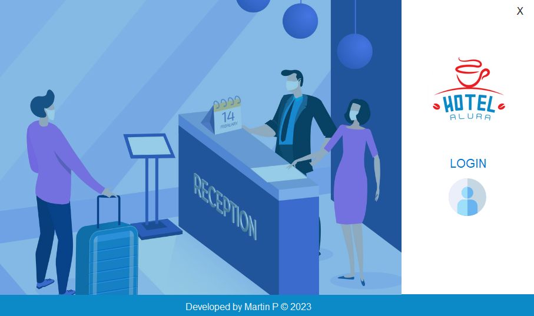

# Hotel Alura

Hotel Alura is a desktop application that allows you to manage guests, users, and bookings. 
You can perform actions like inset, modify, consult, and delete users, guests, and reservations.

## Features

- Register and manage users, guests, and reservations.
- View reservations, guests, and users information.
- Automatic delete of reservations and guests.

## Requirements

- MySQL Workbench
- Java 8 or higher
- Internet connection (for downloading POM dependencies)

## Installation

1. Execute the file `MyDBALura.sql` located in the root directory of the project using MySQL Workbench.
2. Run `PrincipalMenu.java` located at `HotelAlura/src/main/java/views/PrincipalMenu.java`.

## Usage

1. Launch the application.
2. Click on the login image.
3. Enter a valid username and password. If correct, you'll gain access to the application; otherwise, try again.
4. Once logged in, you can navigate through the application's functionalities.
5. To modify a user, reservation, or guest, navigate to the "Search" window, edit the desired field in the respective row, and click "Edit." Note that certain fields like ID, booking ID, and value are auto-assigned and cannot be modified.
6. Guests must be adults, and reservations can be made for any duration.

## Demo Video

A video showcasing the usage of the application is available

## Contributing

Contributions are welcome! If you'd like to contribute to the project, feel free to submit issues or pull requests.

## Contact

For questions or feedback, you can reach out to the project owner at yoztacontreras@outlook.com.

## License

This project is not currently licensed, but you are free to use and modify it as needed.

---
